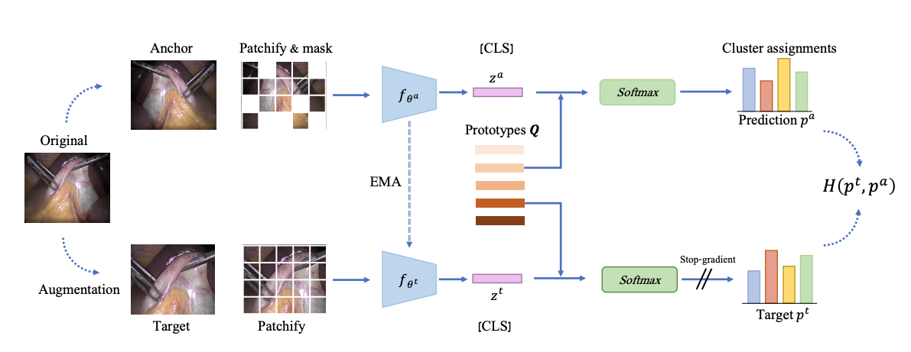

# Self-Supervised Learning for Endoscopic Video Analysis

Code and models for MICCAI23 paper: "Self-Supervised Learning for Endoscopy Video Analysis".


## Background
Self-supervised learning (SSL) has led to important breakthroughs in computer vision by allowing learning from large amounts of unlabeled data. As such, it might have a pivotal role to play in biomedicine where annotating data requires a highly specialized expertise.

In this work, we study the use of a leading SSL framework, Masked Siamese Networks (MSNs), for endoscopic video analysis such as colonoscopy and laparoscopy. To fully exploit the power of SSL, we create sizable endoscopic video datasets. Our extensive experiments show that MSN training on this data leads to state-of-the-art performance in public standard endoscopic benchmarks such as surgical phase recognition during laparoscopy and in colonoscopic polyp characterization. 

Furthermore, we show that 50% the annotated data are sufficient to match the performance when training on the entire labeled datasets. Our work provides evidence that SSL can dramatically reduce the need of annotated data in endoscopy.





## Pre-trained models
We release a series of models pre-trained with our method over a large corpus of endoscopic videos:


| Arch | Dataset | Down-stream results | Link |
| - | - | - | - |
| ViT-S | Private Laparoscopy | Cholec80 F1: 83.4 | [Link](https://drive.google.com/drive/folders/1CctMDXGo8AlyZQSoWwiVyssMrEBZp3IE?usp=drive_link) |
| ViT-B | Private Laparoscopy | Cholec80 F1: 82.6 | [Link](https://drive.google.com/drive/folders/1zcLKhE7H50GIDeb53chLrE5SUBtBooAR?usp=drive_link) |
| ViT-L | Private Laparoscopy | Cholec80 F1: 84.0 | [Link](https://drive.google.com/drive/folders/11TdNyl4HGvpoi6Ro0zZ28L1qxY4IAJPb?usp=drive_link) |
| - | - | - | - |
| ViT-S | Private Colonoscopy | PolypSet Acc: 78.5 | [Link](https://drive.google.com/drive/folders/1GfBVLh3r6A2ctkJyy_1Uc0onSg8tNykM?usp=drive_link) |
| ViT-B | Private Colonoscopy | PolypSet Acc: 78.2 | [Link](https://drive.google.com/drive/folders/1-ispnt7CElWxntmA61XDDHbbBDwZ6njN?usp=drive_link) |
| ViT-L | Private Colonoscopy | PolypSet Acc: 80.4 | [Link](https://drive.google.com/drive/folders/1eq_KcAY_OQU07Ey8XFpvWlsZhMDfl86K?usp=drive_link) |

## Repository

## Environment
You may use the ```requirements.`txt``` file for reproduction of our development environment.
```
conda create --name <env_name> --file ./requirements.txt
```

### Data
We publish the data modules for Cholec80 experiments, which can be easily adopted to the rest of the paper. Our data pipeline is heavily adopted from [TF-Cholec80](https://github.com/CAMMA-public/TF-Cholec80/tree/master). 

Run ```prepare.py``` for downloading and extracting the public Cholec80 dataset:

```
python prepare.py --data_rootdir YOUR_LOCATION
```

The ```./data/cholec80_images.py``` module contains classes for loading the pre-processed datasets into a TF dataset object.

### Down-stream experiments
```./down_stream/main.py``` is the entry point for running the downstream experiments, where a pre-trained module can be fine-tunned for the task of phase classification.

### Inference
```./inference.py``` script can be used for loading a pre-trained model and extracting representations from it.

## Citation
Please cite:
```
@misc{hirsch2023selfsupervised,
      title={Self-Supervised Learning for Endoscopic Video Analysis}, 
      author={Roy Hirsch and Mathilde Caron and Regev Cohen and Amir Livne and Ron Shapiro and Tomer Golany and Roman Goldenberg and Daniel Freedman and Ehud Rivlin},
      year={2023},
      eprint={2308.12394},
      archivePrefix={arXiv},
      primaryClass={cs.CV}
}
```

## License
Our work is licensed under MIT licensed, as found in the [LICENSE](LICENSE) file.


